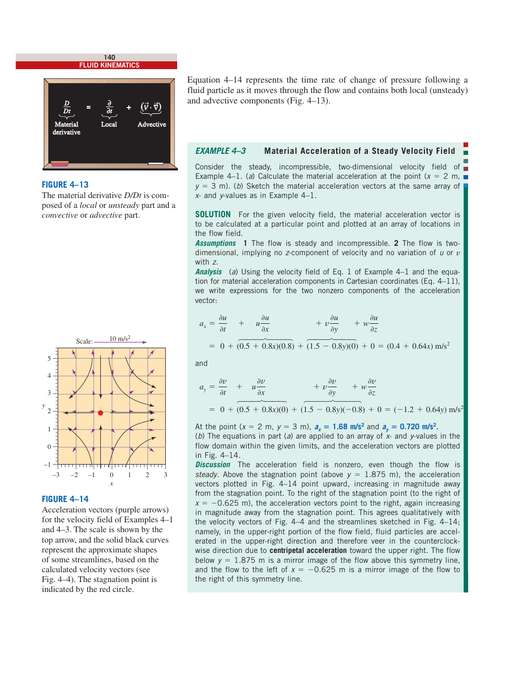
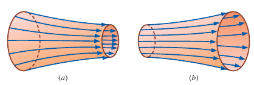
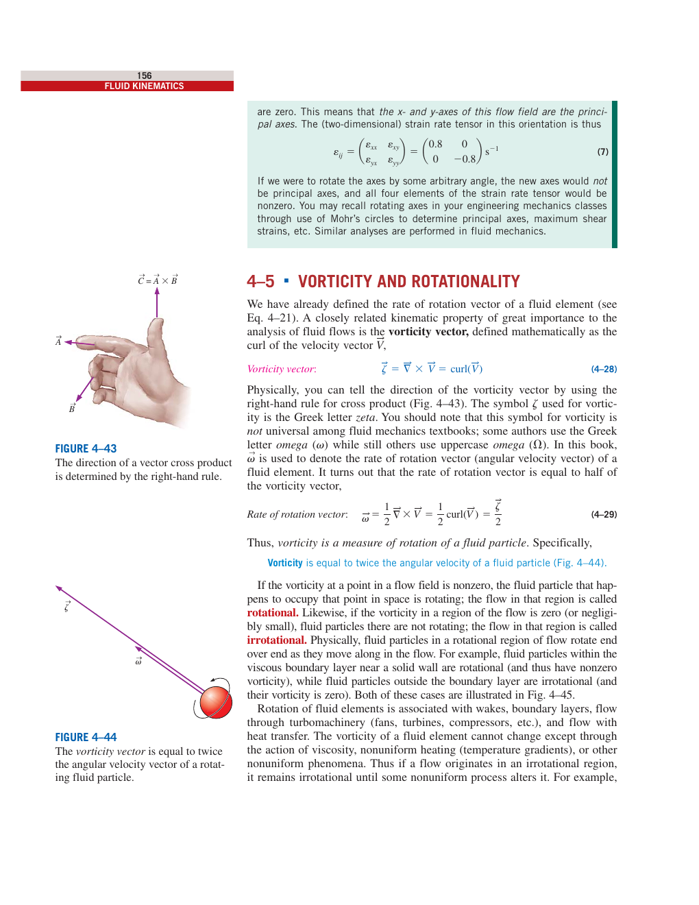
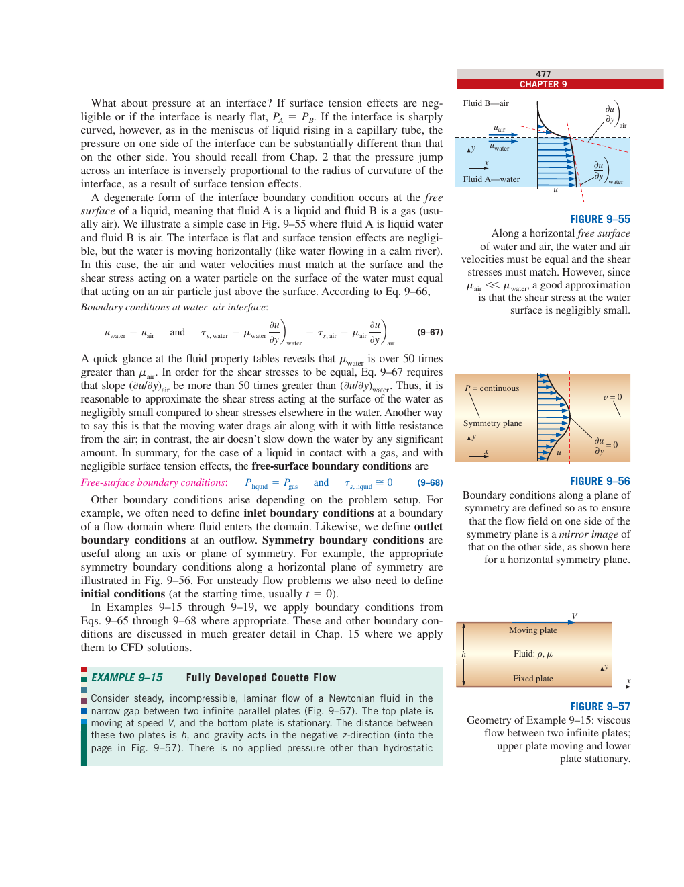
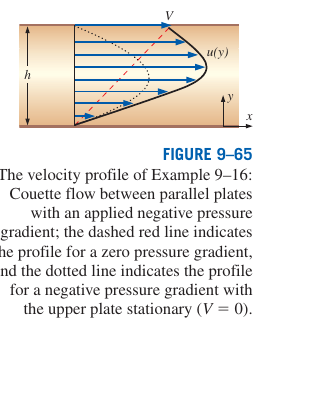
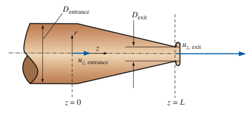
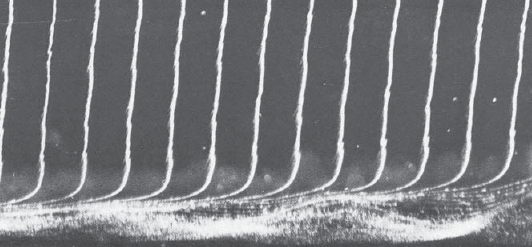

# Cours Théorique — Mécanique des Fluides et Solveurs OpenFOAM
### TP Poiseuille — ENSM — Niveau L3/M1

> **Objectif** : Construire le lien rigoureux entre les équations fondamentales de la mécanique des fluides et les choix de solveurs dans une simulation CFD. Ce document est à la fois un rappel de cours théorique et un guide de lecture des simulations du TP.

---

## TABLE DES MATIÈRES

1. [Cinématique des fluides](#1-cinématique-des-fluides)
2. [Conservation de la masse — Équation de continuité](#2-conservation-de-la-masse)
3. [Quantité de mouvement — Équations de Navier-Stokes](#3-quantité-de-mouvement--navier-stokes)
4. [Solutions analytiques exactes](#4-solutions-analytiques-exactes)
5. [Longueur de développement hydrodynamique](#5-longueur-de-développement-hydrodynamique)
6. [Bernoulli et écoulement potentiel](#6-bernoulli-et-écoulement-potentiel)
7. [Notions de turbulence](#7-notions-de-turbulence)
8. [Méthodes numériques en CFD](#8-méthodes-numériques-en-cfd)
9. [Solveurs OpenFOAM du TP](#9-solveurs-openfoam-du-tp)
10. [Analyse critique et validation](#10-analyse-critique-et-validation)
11. [Exercices et mini-défis](#11-exercices-et-mini-défis)

---

## 1. Cinématique des Fluides

La **cinématique** étudie le mouvement des fluides indépendamment des forces qui le causent. Elle fournit le vocabulaire et les outils pour décrire, visualiser et analyser tout écoulement.

### 1.1 Descriptions lagrangienne et eulérienne

Il existe deux façons fondamentalement différentes de décrire le mouvement d'un fluide.

**Description lagrangienne** : on suit chaque particule fluide individuellement. La particule $A$ est repérée par sa position $\vec{x}_A(t)$ et sa vitesse $\vec{V}_A(t)$ en fonction du temps. C'est la description naturelle de la mécanique des solides (Newton). Appliquée à un fluide, elle est impraticable car le nombre de particules est infini.

**Description eulérienne** : on observe ce qui se passe en un point fixe $(x, y, z)$ du domaine. On définit des champs :

$$\text{Champ de vitesse :} \quad \vec{V} = \vec{V}(x, y, z, t)$$
$$\text{Champ de pression :} \quad P = P(x, y, z, t)$$
$$\text{Champ d'accélération :} \quad \vec{a} = \vec{a}(x, y, z, t)$$

> **Analogie** : en lagrangien, on jette une bouée à la mer et on la suit. En eulérien, on plante un capteur de courant à position fixe et on lit les données.

En **coordonnées cartésiennes**, le champ de vitesse s'écrit :

$$\vec{V} = u(x,y,z,t)\,\hat{i} + v(x,y,z,t)\,\hat{j} + w(x,y,z,t)\,\hat{k}$$

### 1.2 Dérivée matérielle

Le lien entre les deux descriptions est la **dérivée matérielle** (ou dérivée particulaire) $D/Dt$, qui exprime la variation d'une quantité en suivant une particule fluide :

$$\frac{D\vec{V}}{Dt} = \underbrace{\frac{\partial \vec{V}}{\partial t}}_{\text{accél. locale}} + \underbrace{(\vec{V} \cdot \nabla)\vec{V}}_{\text{accél. advective}}$$

- L'**accélération locale** $\partial\vec{V}/\partial t$ est nulle pour un écoulement stationnaire.
- L'**accélération advective** $(\vec{V} \cdot \nabla)\vec{V}$ est présente même en régime permanent si la vitesse varie spatialement (convergent, coude...).

> **Important pour le TP** : dans l'écoulement de Poiseuille **pleinement établi**, l'accélération advective est nulle ($u$ ne dépend que de $y$). Dans la zone d'entrée, elle est non nulle — c'est pourquoi le canal court ne donne pas la bonne pression analytique.


*Fig. 4-13/14 (Cengel & Cimbala Chap.4) — La dérivée matérielle $D/Dt$ se décompose en partie locale $\partial/\partial t$ et partie advective $(\vec{V}\cdot\nabla)$. Le champ d'accélération (flèches) et les lignes de courant (courbes noires) sont tracés pour un champ de vitesse 2D stationnaire.*

### 1.3 Visualisation des écoulements

| Outil            | Définition                                   | Propriété                                |
|------------------|----------------------------------------------|------------------------------------------|
| Ligne de courant | Tangente à $\vec{V}$ à un instant $t$ donné  | Ne se croisent jamais (si $\vec{V}\neq 0$) |
| Trajectoire      | Chemin réel d'une particule fluide           | Coïncide avec ligne de courant en régime stationnaire |
| Traînée          | Trace laissée par un traceur injecté         | Intéresse la visualisation expérimentale |

En **régime stationnaire**, lignes de courant, trajectoires et traînées sont confondues.


*Fig. 4-19/20/21 (Cengel & Cimbala Chap.4) — Tube de courant (Fig. 4-19) : sa section diminue quand l'écoulement accélère (continuité). Trajectoire (Fig. 4-20) : chemin d'une particule individuelle. Photo expérimentale (Fig. 4-21) : trajectoires elliptiques de particules sous des ondes de surface — en régime instationnaire, trajectoire ≠ ligne de courant.*

### 1.4 Propriétés cinématiques fondamentales

Tout mouvement d'un élément fluide se décompose en **quatre contributions** :

1. **Translation** : déplacement du centre de masse.
2. **Rotation** : rotation de corps rigide autour d'un axe.
3. **Taux de déformation linéaire** (dilatation) : étirement le long des axes.
4. **Taux de déformation angulaire** (cisaillement) : distorsion de forme.

Le **vecteur vorticité** $\vec{\zeta}$ mesure la rotation locale :

$$\vec{\zeta} = \nabla \times \vec{V} = \text{rot}\,\vec{V}$$

En 2D (plan $xy$) :

$$\zeta_z = \frac{\partial v}{\partial x} - \frac{\partial u}{\partial y}$$

- Si $\vec{\zeta} = \vec{0}$ partout : l'écoulement est **irrotationnel** (potentiel).
- Pour l'écoulement de Poiseuille : $\zeta_z = -dU/dy \neq 0$ → écoulement **rotationnel** (visqueux).


*Fig. 4-43/44 (Cengel & Cimbala Chap.4) — Section 4-5 : vorticité et rotationnalité. Le vecteur vorticité $\vec{\zeta} = \nabla\times\vec{V}$ est égal au double de la vitesse angulaire locale d'un élément fluide ($\vec{\zeta} = 2\vec{\omega}$). Sa direction est donnée par la règle de la main droite.*

### 1.5 Fonction de courant

En écoulement **2D incompressible**, on peut définir la **fonction de courant** $\psi(x,y)$ telle que :

$$u = \frac{\partial \psi}{\partial y}, \quad v = -\frac{\partial \psi}{\partial x}$$

Les **courbes** $\psi = \text{constante}$ sont des **lignes de courant**. La différence $\Delta\psi = \psi_2 - \psi_1$ entre deux lignes de courant est égale au débit volumique (par unité de largeur) qui passe entre elles :

$$\frac{\dot{V}}{w} = \psi_2 - \psi_1$$

Pour un écoulement **irrotationnel**, la fonction de courant satisfait l'équation de Laplace :

$$\nabla^2\psi = 0$$

---

## 2. Conservation de la Masse

### 2.1 Forme intégrale (volume de contrôle)

La loi de conservation de la masse s'écrit pour un volume de contrôle :

$$\frac{dm_{CV}}{dt} = \dot{m}_{in} - \dot{m}_{out}$$

En formulation intégrale générale :

$$\frac{\partial}{\partial t}\int_{CV}\rho\,dV + \oint_{CS}\rho\vec{V}\cdot\hat{n}\,dA = 0$$

Pour un **régime stationnaire** ($\partial/\partial t = 0$) avec entrées/sorties bien définies :

$$\sum_{out}\dot{m} - \sum_{in}\dot{m} = 0 \quad \Rightarrow \quad \rho_1 A_1 V_1 = \rho_2 A_2 V_2$$

Pour un fluide **incompressible** ($\rho$ = constante) : $A_1 V_1 = A_2 V_2$.

### 2.2 Dérivation de la forme différentielle

En appliquant le **théorème de la divergence** (Gauss) à la forme intégrale, l'intégrale de surface devient une intégrale de volume :

$$\oint_{CS}\rho\vec{V}\cdot\hat{n}\,dA = \int_{CV}\nabla\cdot(\rho\vec{V})\,dV$$

En substituant dans l'équation intégrale et en exigeant que le résultat soit nul pour **tout** volume de contrôle, on obtient l'**équation de continuité différentielle** :

$$\boxed{\frac{\partial \rho}{\partial t} + \nabla\cdot(\rho\vec{V}) = 0}$$

### 2.3 Cas incompressible

Pour un fluide incompressible ($D\rho/Dt = 0$, i.e. $\rho$ = constante suivant une particule) :

$$\boxed{\nabla\cdot\vec{V} = 0}$$

En coordonnées cartésiennes :

$$\frac{\partial u}{\partial x} + \frac{\partial v}{\partial y} + \frac{\partial w}{\partial z} = 0$$

> **Interprétation** : le volume d'une particule fluide incompressible est conservé. Il n'y a ni source ni puits de volume dans le domaine.

**Application au TP — canal de Poiseuille** : l'eau est incompressible. En 2D, $\partial u/\partial x + \partial v/\partial y = 0$. En régime établi, $\partial u/\partial x = 0$ (profil invariant en $x$), donc $\partial v/\partial y = 0$. Avec la condition de non-glissement aux parois ($v=0$ aux parois), on conclut $v = 0$ partout : l'écoulement est purement horizontal.

---

## 3. Quantité de Mouvement — Navier-Stokes

### 3.1 Équation de Cauchy

En appliquant la deuxième loi de Newton à un volume de contrôle différentiel, on obtient l'équation générale de la quantité de mouvement, dite **équation de Cauchy** :

$$\frac{\partial(\rho\vec{V})}{\partial t} + \nabla\cdot(\rho\vec{V}\vec{V}) = \rho\vec{g} + \nabla\cdot\boldsymbol{\sigma}$$

où $\boldsymbol{\sigma}$ est le **tenseur des contraintes** (dimensions : Pa = N/m²). Il se décompose en une partie sphérique (pression) et une partie déviatorique (viscosité) :

$$\sigma_{ij} = -P\delta_{ij} + \tau_{ij}$$

avec $\tau_{ij}$ le **tenseur des contraintes visqueuses**.

### 3.2 Fluide Newtonien et tenseur visqueux

Un fluide est dit **Newtonien** si les contraintes visqueuses sont proportionnelles aux taux de déformation. Pour un fluide newtonien incompressible, de viscosité dynamique $\mu$ :

$$\tau_{ij} = \mu\left(\frac{\partial u_i}{\partial x_j} + \frac{\partial u_j}{\partial x_i}\right)$$

L'eau et l'air sont des fluides newtoniens à conditions ambiantes.

### 3.3 Équations de Navier-Stokes incompressibles

En substituant la loi de comportement newtonienne dans l'équation de Cauchy pour un fluide incompressible :

$$\boxed{\rho\left[\frac{\partial\vec{V}}{\partial t} + (\vec{V}\cdot\nabla)\vec{V}\right] = -\nabla P + \rho\vec{g} + \mu\nabla^2\vec{V}}$$

Ces équations, couplées à la continuité $\nabla\cdot\vec{V}=0$, forment le système complet décrivant tout écoulement incompressible newtonien.

**Composantes en cartésien 2D** (plan $xy$, sans gravité) :

Direction $x$ :
$$\rho\left(\frac{\partial u}{\partial t} + u\frac{\partial u}{\partial x} + v\frac{\partial u}{\partial y}\right) = -\frac{\partial P}{\partial x} + \mu\left(\frac{\partial^2 u}{\partial x^2} + \frac{\partial^2 u}{\partial y^2}\right)$$

Direction $y$ :
$$\rho\left(\frac{\partial v}{\partial t} + u\frac{\partial v}{\partial x} + v\frac{\partial v}{\partial y}\right) = -\frac{\partial P}{\partial y} + \mu\left(\frac{\partial^2 v}{\partial x^2} + \frac{\partial^2 v}{\partial y^2}\right)$$

> **Note sur la pression dans OpenFOAM** : les solveurs incompressibles d'OpenFOAM (`icoFoam`, `simpleFoam`) travaillent avec la **pression cinématique** $p = P/\rho$ [m²/s²], et la viscosité cinématique $\nu = \mu/\rho$ [m²/s]. Les équations deviennent :
>
> $$\frac{\partial\vec{U}}{\partial t} + (\vec{U}\cdot\nabla)\vec{U} = -\nabla p + \nu\nabla^2\vec{U}$$

### 3.4 Analyse dimensionnelle et Nombre de Reynolds

En adimensionnalisant les équations de Navier-Stokes avec une vitesse de référence $U_0$, une longueur de référence $L$ et une pression de référence $\rho U_0^2$ :

$$\frac{\partial\vec{U}^{\ast}}{\partial t^{\ast}} + (\vec{U}^{\ast}\cdot\nabla^{\ast})\vec{U}^{\ast} = -\nabla^{\ast} p^{\ast} + \frac{1}{Re}(\nabla^{\ast})^2\vec{U}^{\ast}$$

Le seul paramètre adimensionnel est le **nombre de Reynolds** :

$$\boxed{Re = \frac{U_0 L}{\nu} = \frac{\text{Forces inertielles}}{\text{Forces visqueuses}}}$$

Pour un canal de hauteur $H$ et vitesse débitante $U_{moy}$ :

$$Re = \frac{U_{moy}\,H}{\nu}$$

| Régime      | Reynolds           | Caractère                            |
|-------------|-------------------|--------------------------------------|
| Laminaire   | $Re < 2300$        | Écoulement ordonné, couches parallèles |
| Transitoire | $2300 < Re < 4000$ | Instable, bouffées turbulentes       |
| Turbulent   | $Re > 4000$        | Mélange intense, fluctuations        |

**Application au TP** ($\nu = 0.001$ m²/s, $H = 1$ m) :

| Cas   | $U_{moy}$ (m/s) | Re    | Régime    |
|-------|----------------|-------|-----------|
| case0 | 1.0            | 1000  | Laminaire |
| case1 | 0.5            | 500   | Laminaire |
| case2 | 1.5            | 1500  | Laminaire |
| case3 | 1.5            | 1500  | Laminaire |
| case4 | 1.0            | 1000  | Potentiel (inviscide) |
| case5 | 1.0            | 1000  | Laminaire |

> Tous les cas laminaires du TP sont à $Re < 2000$ : les hypothèses d'un écoulement laminaire newtonien sont parfaitement justifiées.

---

## 4. Solutions Analytiques Exactes

### 4.1 Procédure générale de résolution

Les solutions exactes des équations de Navier-Stokes sont rares — elles nécessitent des géométries simples et des hypothèses simplificatrices. La démarche en 6 étapes est :

1. **Poser le problème** et définir la géométrie et le système de coordonnées.
2. **Lister les hypothèses** et les conditions aux limites.
3. **Simplifier** les équations différentielles.
4. **Résoudre** les équations simplifiées.
5. **Appliquer les conditions aux limites** pour déterminer les constantes.
6. **Vérifier** que toutes les équations et C.L. sont satisfaites.

### 4.2 Conditions aux limites fondamentales

**Condition de non-glissement** (no-slip) : à toute paroi solide, la vitesse du fluide est égale à celle de la paroi. Pour une paroi fixe :

$$\vec{V}_{fluide}\big|_{paroi} = \vec{0}$$

C'est la condition la plus utilisée. Elle traduit l'adhérence moléculaire entre fluide et solide.

**Condition à la surface libre** (free surface) : à l'interface liquide-gaz, en négligeant la tension de surface et la viscosité du gaz :

$$P_{liquide} = P_{gaz}, \qquad \tau_{s, liquide} \approx 0$$

En pratique, la surface libre est traitée comme une paroi à contrainte de cisaillement nulle.

**Condition d'entrée** : profil de vitesse imposé à l'entrée du domaine.

**Condition de symétrie** : $\partial u/\partial n = 0$ et $V_n = 0$ sur l'axe de symétrie.

### 4.3 Écoulement de Couette (référence pédagogique)

L'écoulement de Couette est un écoulement entre deux plaques planes parallèles, l'une fixe et l'autre en mouvement à vitesse $V$ dans la direction $x$, sans gradient de pression appliqué.

**Hypothèses** : régime permanent, 2D, incompressible, sans gradient de pression, plaques infinies.

La simplification de l'équation de continuité donne $u = u(y)$ seulement. La simplification de la composante $x$ de Navier-Stokes donne :

$$\frac{d^2u}{dy^2} = 0 \quad \Rightarrow \quad u = C_1 y + C_2$$

Application des C.L. ($u=0$ en $y=0$, $u=V$ en $y=h$) :

$$\boxed{u(y) = V\frac{y}{h}}$$

Profil **linéaire**. La contrainte de cisaillement à la paroi est uniforme : $\tau_{wall} = \mu V/h$.


*Fig. 9-55/56/57 (Cengel & Cimbala Chap.9) — Conditions aux limites fondamentales : surface libre eau-air (Fig. 9-55), plan de symétrie (Fig. 9-56), et géométrie de l'écoulement de Couette — Fig. 9-57 : plaque inférieure fixe, plaque supérieure se déplaçant à vitesse $V$, fluide newtonien de viscosité $\mu$ entre les deux.*

### 4.4 Écoulement de Poiseuille Plan (canal 2D)

C'est l'écoulement d'un fluide visqueux entre deux plaques parallèles fixes, mis en mouvement par un gradient de pression appliqué. C'est le cas physique du TP.

**Géométrie** : canal de hauteur $H$, parois en $y = 0$ et $y = H$, écoulement dans la direction $x$.

**Hypothèses** :
1. Plaques infinies dans $x$ et $z$.
2. Régime permanent ($\partial/\partial t = 0$).
3. Écoulement parallèle : $v = 0$.
4. Fluide incompressible, newtonien, laminaire.
5. Gradient de pression $\partial P/\partial x$ = constante.
6. Écoulement 2D : $w = 0$, $\partial/\partial z = 0$.
7. Gravité négligée.

**Étape 3 — Simplification** :

La continuité donne : $\partial u/\partial x = 0$ → $u = u(y)$ seulement.

La composante $y$ de Navier-Stokes : $\partial P/\partial y = 0$ → $P = P(x)$ seulement.

La composante $x$ se réduit à :

$$0 = -\frac{dP}{dx} + \mu\frac{d^2u}{dy^2}$$

ou encore :

$$\frac{d^2u}{dy^2} = \frac{1}{\mu}\frac{dP}{dx} = \text{constante}$$

> **Clé** : le terme d'accélération advective $u\,\partial u/\partial x$ est nul en raison de la continuité ($u$ ne dépend pas de $x$). L'équation de Navier-Stokes devient **linéaire** et exactement intégrable.

**Étape 4 — Résolution** :

On intègre deux fois l'ODE :

$$u = \frac{1}{\mu}\frac{dP}{dx}\frac{y^2}{2} + C_1 y + C_2$$

**Étape 5 — Conditions aux limites** :
- En $y = 0$ : $u = 0$ → $C_2 = 0$
- En $y = H$ : $u = 0$ → $C_1 = -\frac{1}{2\mu}\frac{dP}{dx}H$

Profil de vitesse final :

$$\boxed{u(y) = -\frac{1}{2\mu}\frac{dP}{dx}\,y(H - y)}$$

Ce profil est une **parabole** avec un maximum au centre ($y = H/2$) :

$$u_{max} = -\frac{H^2}{8\mu}\frac{dP}{dx}$$

**Vitesse débitante** (moyenne sur la section) :

$$U_{moy} = \frac{1}{H}\int_0^H u(y)\,dy = -\frac{H^2}{12\mu}\frac{dP}{dx}$$

Relation entre maximum et moyenne :

$$\boxed{u_{max} = \frac{3}{2}\,U_{moy}}$$

**Gradient de pression** en fonction du débit :

$$\frac{dP}{dx} = -\frac{12\,\mu\,U_{moy}}{H^2}$$

**Formulation classique** (avec $y$ centré sur l'axe, $y \in [-H/2, H/2]$) :

$$u(y) = \frac{3}{2}\,U_{moy}\left[1 - \left(\frac{2y}{H}\right)^2\right]$$

**Chute de pression** sur un canal de longueur $L$ :

$$\Delta P = \frac{12\,\mu\,U_{moy}}{H^2}\,L \quad \text{[Pa]}$$

ou en pression cinématique OpenFOAM ($p = P/\rho$, $\nu = \mu/\rho$) :

$$\Delta p_{kin} = \frac{12\,\nu\,U_{moy}}{H^2}\,L \quad [\mathrm{m^2/s^2}]$$


<em>Fig. 9-65 (Cengel & Cimbala Chap.9) — Profil de vitesse de l'exemple 9-16 (Couette + gradient de pression). <strong>Cas particulier $V=0$ (pointillés)</strong> : la plaque supérieure est fixe et seul le gradient de pression entraîne l'écoulement → c'est la parabole de Poiseuille plan $u(y) = \frac{1}{2\mu}\frac{\partial P}{\partial x}(y^2-hy)$, solution exacte du TP OpenFOAM.</em>

### 4.5 Écoulement de Poiseuille Cylindrique (conduite ronde)

Pour une conduite circulaire de rayon $R$, en coordonnées cylindriques $(r, \theta, x)$, la même démarche donne :

$$u(r) = \frac{1}{4\mu}\frac{dP}{dx}(r^2 - R^2) = -\frac{R^2}{4\mu}\left(-\frac{dP}{dx}\right)\left[1 - \left(\frac{r}{R}\right)^2\right]$$

Profil parabolique de révolution. La vitesse débitante et le maximum :

$$U_{moy} = -\frac{R^2}{8\mu}\frac{dP}{dx}, \qquad u_{max} = 2\,U_{moy}$$

Le débit volumique (**loi de Hagen-Poiseuille**) :

$$\dot{V} = -\frac{\pi R^4}{8\mu}\frac{dP}{dx} = \frac{\pi R^4 \Delta P}{8\mu L}$$

> **Comparaison** : en canal plan $u_{max} = 1.5\,U_{moy}$ ; en conduite ronde $u_{max} = 2\,U_{moy}$. La géométrie influence fortement le rapport pic/moyenne.

### 4.6 Application numérique au TP

Pour **case0** (eau, $\nu = 0.001$ m²/s, $U_{moy} = 1.0$ m/s, $H = 1$ m, $L = 100$ m) :

| Grandeur          | Formule                              | Valeur                  |
|-------------------|--------------------------------------|-------------------------|
| $u_{max}$         | $\frac{3}{2}U_{moy}$                 | **1.50 m/s**            |
| $dP/dx$           | $-12\nu U_{moy}/H^2$                | **−0.012 Pa/m**         |
| $\Delta p_{kin}$  | $12\nu U_{moy}L/H^2$                | **1.20 m²/s²**          |
| $\Delta P_{SI}$   | $\rho\,\Delta p_{kin}$               | **1 200 Pa**            |

Pour **case5** ($U_{moy} = 1.0$ m/s, $L = 200$ m) : $\Delta P = 2\,400$ Pa (canal deux fois plus long que case0).

---

## 5. Longueur de Développement Hydrodynamique

### 5.1 Définition

La solution de Poiseuille est valide uniquement en **régime pleinement établi** (fully developed flow). À l'entrée du canal, le profil de vitesse est généralement uniforme ("bouchon"). La couche limite visqueuse croît depuis les parois jusqu'à ce que les deux couches se rejoignent à l'axe. C'est la **zone d'entrée** (entrance region).

La **longueur de développement** $L_{dev}$ est la distance depuis l'entrée à partir de laquelle le profil de vitesse peut être considéré comme établi (erreur < 1% par rapport au profil de Poiseuille) :

$$\boxed{L_{dev} \approx 0.05 \times Re \times H \quad \text{(canal plan, régime laminaire)}}$$

Pour une conduite circulaire : $L_{dev} \approx 0.06 \times Re \times D$.

### 5.2 Physique de la zone d'entrée

Dans la zone d'entrée :
- Le profil de vitesse est **plus plat** que la parabole de Poiseuille.
- La vitesse maximale augmente progressivement de $U_{moy}$ (entrée) vers $1.5\,U_{moy}$ (sortie pour $L \gg L_{dev}$).
- La conservation de la masse impose une accélération du fluide au centre → **gradient de pression supplémentaire** par rapport au régime établi.
- Les termes advectifs $u\,\partial u/\partial x$ sont **non nuls** : Navier-Stokes est non-linéaire dans cette zone.

> **Conséquence pour la pression** : la chute de pression mesurée dans un canal court est **supérieure** à la valeur analytique de Poiseuille car elle intègre la décélération du profil d'entrée (perte d'énergie cinétique par redistribution). C'est ce qu'on observait dans l'ancienne version du TP avec $L = 10$ m.


*Fig. P9-29 (Cengel & Cimbala Chap.9) — Exercice sur la zone d'entrée d'une conduite : le diamètre varie de $D_{entrée}$ à $D_{sortie}$ selon le développement du profil axial $u_z(r,z)$. Illustre pourquoi la longueur de développement $L_{dev}$ est un paramètre **physique** (pas numérique) — les simulations case0-5 ont été allongées à $2 \times L_{dev}$ pour s'affranchir de cet effet.*

### 5.3 Tableau du TP — longueurs mises à jour

| Cas   | Solveur      | $U_{moy}$ | Re    | $L_{dev}$ | $L_{canal}$ | $L/L_{dev}$ | Statut |
|-------|-------------|-----------|-------|-----------|-------------|-------------|--------|
| case0 | icoFoam     | 1.0 m/s   | 1000  | 50 m      | **100 m**   | 2.0×        | ✅ Établi |
| case1 | icoFoam     | 0.5 m/s   | 500   | 25 m      | **50 m**    | 2.0×        | ✅ Établi |
| case2 | icoFoam     | 1.5 m/s   | 1500  | 75 m      | **150 m**   | 2.0×        | ✅ Établi |
| case3 | simpleFoam  | 1.5 m/s   | 1500  | 75 m      | **150 m**   | 2.0×        | ✅ Établi |
| case4 | potentialFoam | 1.0 m/s | —     | N/A       | 10 m        | —           | Inviscide |
| case5 | icoFoam     | 1.0 m/s   | 1000  | 50 m      | **200 m**   | 4.0×        | ✅✅ Très établi |

> **Évolution pédagogique** : tous les canaux ont été allongés à $2 \times L_{dev}$ (voire $4\times$ pour case5) afin que chaque simulation atteigne le régime établi et que la comparaison avec l'analytique soit physiquement pertinente.

### 5.4 Critère de convergence vers le profil de Poiseuille

Une règle pratique pour estimer le **degré d'établissement** :

$$\varepsilon_{max}(x) = \frac{u_{max}(x) - u_{max,\infty}}{u_{max,\infty}} \approx \exp\!\left(-\alpha\frac{x}{L_{dev}}\right)$$

avec $\alpha \approx 3$ pour un canal plan. À $x = L_{dev}$, l'erreur est réduite à $\approx 5\%$. À $x = 2\,L_{dev}$, elle est $< 0.3\%$.

> **Message clé** : la longueur de développement n'est pas un paramètre numérique — c'est de la **physique**. Un canal trop court ne donnera pas la solution analytique, quelle que soit la précision du maillage.

---

## 6. Bernoulli et Écoulement Potentiel

### 6.1 Équation de Bernoulli

L'équation de Bernoulli est une **intégrale de l'équation de quantité de mouvement** valable le long d'une **ligne de courant** sous les hypothèses suivantes :
- Fluide **inviscide** ($\mu = 0$)
- Écoulement **stationnaire** ($\partial/\partial t = 0$)
- Fluide **incompressible** ($\rho$ = constante)
- Pas de **travail extérieur**

$$\boxed{\frac{U^2}{2} + \frac{P}{\rho} + gz = \text{constante le long d'une ligne de courant}}$$

ou encore :

$$\frac{U_1^2}{2} + \frac{P_1}{\rho} + gz_1 = \frac{U_2^2}{2} + \frac{P_2}{\rho} + gz_2$$

Chaque terme a les dimensions d'une énergie par unité de masse (J/kg) :
- $U^2/2$ : énergie cinétique par unité de masse
- $P/\rho$ : énergie de pression par unité de masse
- $gz$ : énergie potentielle par unité de masse

> ⚠️ **Limitations fondamentales de Bernoulli** :
> 1. **Pas de viscosité** : aucune dissipation, aucune couche limite, aucune perte de charge.
> 2. **Valable le long d'une ligne de courant** (dans un écoulement irrotationnel, valide partout).
> 3. **Non applicable** dans les zones de recirculation, les sillages, les couches limites.

### 6.2 Écoulement potentiel

Un écoulement est **irrotationnel** si $\nabla \times \vec{V} = \vec{0}$ partout. Dans ce cas, on peut définir un **potentiel de vitesse** $\Phi$ tel que :

$$\vec{V} = \nabla\Phi \quad \Rightarrow \quad u = \frac{\partial\Phi}{\partial x},\; v = \frac{\partial\Phi}{\partial y}$$

En combinant avec la continuité incompressible :

$$\nabla\cdot\vec{V} = 0 \quad \Rightarrow \quad \nabla^2\Phi = 0$$

L'**équation de Laplace** $\nabla^2\Phi = 0$ est linéaire : on peut superposer des solutions élémentaires (source, puits, vortex, doublet, écoulement uniforme) pour construire des écoulements complexes.

**Propriétés importantes** :
- Courbes $\Phi = \text{cte}$ (**équipotentielles**) et courbes $\psi = \text{cte}$ (**lignes de courant**) sont **orthogonales**.
- En écoulement potentiel : **pas de traînée** (paradoxe de d'Alembert), **aucune perte de charge**.

### 6.3 Domaine de validité — synthèse

| Modèle         | Viscosité | Turbulence | Pertes de charge | Couche limite | Usage typique |
|----------------|-----------|------------|-----------------|---------------|---------------|
| Potentiel      | Non       | Non        | Non             | Non           | Forme d'aile, aérodynamique extérieure |
| Bernoulli      | Non       | Non        | Non             | Non           | Tube de Pitot, Venturi, estimations rapides |
| N-S laminaire  | Oui       | Non        | Oui             | Oui           | Re < 2300, microfluidique, lubrification |
| N-S turbulent (RANS) | Oui | Modèle | Oui         | Modèle        | Re > 4000, conduits industriels, navires |

### 6.4 Bernoulli dans le TP — potentialFoam (case4)

`potentialFoam` résout $\nabla^2\Phi = 0$ et reconstruit $\vec{U} = \nabla\Phi$. Dans le canal :
- Le profil de vitesse reste **uniforme** (bouchon), $u = U_{moy}$ partout.
- $\Delta P \approx 0$ (aucune dissipation visqueuse).
- La solution est **indépendante de la longueur** du canal (propriété des équations elliptiques).

> **Message pédagogique** : `potentialFoam` est utile pour une initialisation rapide ou pour étudier un contour hydrodynamique (forme de proue, aile de navire). Il est **inutilisable pour quantifier les pertes de charge** ou la traînée de frottement.

---

## 7. Notions de Turbulence

### 7.1 Nature de la turbulence

La turbulence est un régime d'écoulement caractérisé par :
- Des fluctuations **aléatoires et tridimensionnelles** de la vitesse et de la pression.
- Un mélange **intense** favorisant les échanges de chaleur, masse et quantité de mouvement.
- Une **cascade énergétique** : l'énergie est injectée aux grandes échelles (tourbillons énergétiques), transférée vers les petites échelles, puis dissipée par viscosité (micro-échelles de Kolmogorov).

La transition laminaire-turbulente dépend du Reynolds mais aussi des perturbations initiales et des conditions aux limites.


*Fig. 4-29 (Cengel & Cimbala Chap.4) — Visualisation expérimentale de la transition laminaire-turbulente par **fil à bulles d'hydrogène** : les timelines (lignes horizontales marquées à $t=0$) se déforment progressivement sous l'effet du profil de vitesse de la couche limite. À droite, on observe l'instabilité de Tollmien-Schlichting qui précède la transition vers la turbulence.*

### 7.2 Approche RANS

Les simulations industrielles utilisent l'approche **RANS** (Reynolds-Averaged Navier-Stokes). On décompose toute quantité en partie moyenne et fluctuation :

$$u = \bar{u} + u', \qquad p = \bar{p} + p'$$

En substituant dans Navier-Stokes et en moyennant temporellement, on obtient les équations RANS :

$$\rho\left[\frac{\partial\bar{u}_i}{\partial t} + \bar{u}_j\frac{\partial\bar{u}_i}{\partial x_j}\right] = -\frac{\partial\bar{p}}{\partial x_i} + \frac{\partial}{\partial x_j}\left[\mu\frac{\partial\bar{u}_i}{\partial x_j} - \rho\overline{u_i'u_j'}\right]$$

Le terme $-\rho\overline{u_i'u_j'}$ est le **tenseur des contraintes de Reynolds**. Il représente le transfert de quantité de mouvement par les fluctuations turbulentes. Il introduit **6 inconnues supplémentaires** → problème de fermeture.

### 7.3 Modèles de turbulence

Pour fermer le système RANS, on modélise les contraintes de Reynolds. Les principaux modèles :

**Modèle $k$-$\varepsilon$** (le plus utilisé en industrie) :
- $k$ : énergie cinétique turbulente $= \frac{1}{2}\overline{u_i'u_i'}$
- $\varepsilon$ : taux de dissipation turbulente
- Deux équations de transport supplémentaires
- Hypothèse de viscosité turbulente : $-\overline{u_i'u_j'} = \nu_t\left(\frac{\partial\bar{u}_i}{\partial x_j}+\frac{\partial\bar{u}_j}{\partial x_i}\right) - \frac{2}{3}k\delta_{ij}$

**Modèle $k$-$\omega$ SST** (Shear Stress Transport, Menter 1994) :
- Combine $k$-$\omega$ près des parois et $k$-$\varepsilon$ loin des parois.
- Mieux adapté aux écoulements avec gradient de pression adverse.
- Recommandé pour l'hydrodynamique navale.

> **Dans le TP** : tous les cas sont laminaires ($Re < 2000$). Le modèle de turbulence est désactivé (`turbulenceProperties: simulationType laminar`). Aucun modèle RANS n'est appliqué.

### 7.4 Profil de vitesse turbulent

En régime turbulent pleinement développé, le profil de vitesse suit la **loi logarithmique** (log-law) :

$$\frac{u}{u_\tau} = \frac{1}{\kappa}\ln\left(\frac{y\,u_\tau}{\nu}\right) + B$$

avec $u_\tau = \sqrt{\tau_w/\rho}$ la vitesse de frottement, $\kappa \approx 0.41$ la constante de Kármán, $B \approx 5.0$. Le rapport pic/moyenne devient $u_{max}/U_{moy} \approx 1.1$–$1.2$ (bien plus plat que le facteur 1.5 laminaire).

---

## 8. Méthodes Numériques en CFD

### 8.1 Principe de la discrétisation

Les équations aux dérivées partielles (EDP) de la mécanique des fluides ne peuvent généralement pas être résolues analytiquement sur des géométries complexes. La CFD les discrétise en un système d'équations algébriques résolu par ordinateur.

**Principales méthodes de discrétisation** :

| Méthode                  | Principe                                 | Usage OpenFOAM |
|--------------------------|------------------------------------------|----------------|
| Différences finies (FDM) | Approximation des dérivées par différences | Grilles structurées |
| Éléments finis (FEM)     | Minimisation résiduelle pondérée         | Structures, Fluides |
| **Volumes finis (FVM)**  | Conservation sur chaque cellule          | **OpenFOAM** ✅ |

OpenFOAM est basé exclusivement sur la **méthode des volumes finis** (Finite Volume Method, FVM).

### 8.2 Méthode des volumes finis

Le domaine est divisé en **cellules de contrôle** (mailles). Pour chaque cellule $C$, on intègre l'équation de conservation sur le volume $V_C$ :

$$\int_{V_C}\frac{\partial(\rho\phi)}{\partial t}\,dV + \oint_{\partial V_C}\rho\phi\vec{V}\cdot\hat{n}\,dA = \oint_{\partial V_C}\Gamma\nabla\phi\cdot\hat{n}\,dA + \int_{V_C}S_\phi\,dV$$

- **Terme transitoire** : variation temporelle dans la cellule.
- **Terme convectif** : flux de $\phi$ à travers les faces.
- **Terme diffusif** : flux diffusif (gradient) à travers les faces.
- **Source** : terme source interne.

La FVM **conserve exactement** la grandeur intégrée sur chaque cellule et sur l'ensemble du domaine → propriété cruciale pour la précision physique.

### 8.3 Couplage pression-vitesse : PISO et SIMPLE

Les équations de N-S incompressible posent un problème particulier : **la pression n'a pas d'équation propre** (contrairement à la masse volumique dans les écoulements compressibles). On utilise la contrainte de continuité pour construire une équation de pression.

**Algorithme SIMPLE** (Semi-Implicit Method for Pressure-Linked Equations) — régime stationnaire :

```
1. Initialiser U, p
2. Résoudre l'équation de quantité de mouvement avec p connu → U*
3. Résoudre l'équation de pression (à partir de continuité) → correction p'
4. Corriger U avec p'
5. Vérifier convergence → si non, retour à 2
```

**Algorithme PISO** (Pressure Implicit with Splitting of Operators) — régime transitoire :

```
À chaque pas de temps :
1. Résoudre l'équation de quantité de mouvement → U*
2. Première correction de pression → U**, p*
3. Deuxième correction de pression → U***, p** (optionnel)
4. Avancer au pas de temps suivant
```

PISO est **plus précis** que SIMPLE en transitoire mais plus coûteux par pas de temps. SIMPLE est adapté aux calculs stationnaires.

**Dans OpenFOAM** :
- `icoFoam` : PISO, N-S transitoire incompressible (laminaire).
- `simpleFoam` : SIMPLE, N-S stationnaire incompressible (laminaire ou turbulent).
- `potentialFoam` : résolution directe de l'équation de Laplace.

### 8.4 Discrétisation temporelle

Pour un calcul transitoire, le pas de temps $\Delta t$ doit respecter le **critère de Courant-Friedrichs-Lewy (CFL)** pour les schémas explicites :

$$Co = \frac{U\,\Delta t}{\Delta x} \leq 1$$

Dans OpenFOAM avec PISO (implicite), on autorise en pratique $Co \leq 1$ à $5$ pour la stabilité, mais $Co \leq 1$ est recommandé pour la précision.

**Schémas temporels disponibles** :
- `Euler` : premier ordre, implicite (stable, dissipateur).
- `CrankNicolson` : second ordre, implicite (plus précis).
- `backward` : second ordre, implicite (OpenFOAM recommandé).

### 8.5 Qualité du maillage

La qualité du maillage conditionne la précision et la convergence. Critères importants :

| Critère          | Définition                                    | Valeur recommandée |
|------------------|-----------------------------------------------|--------------------|
| Orthogonalité    | Angle entre normale à la face et vecteur liant les centres | < 70° (idéal: 0°) |
| Skewness         | Écart entre centre de face et point d'intersection | < 4              |
| Aspect ratio     | Rapport longueur/largeur de cellule           | < 100 (sauf couche limite) |

**Raffinement** : dans les zones à forts gradients (couche limite, sillage), un maillage plus fin est nécessaire. La règle empirique pour la couche limite turbulente est $y^+ \leq 1$ pour une résolution directe de la paroi (ou $30 < y^+ < 300$ pour une loi de paroi).

Dans le TP (laminaire), le maillage uniforme $100 \times 10$ à $2000 \times 10$ est suffisant.

### 8.6 Convergence et résidus

Un calcul **converge** quand les résidus (mesure du déséquilibre des équations) diminuent suffisamment. Dans OpenFOAM, les résidus sont calculés à chaque itération PISO/SIMPLE.

**Critères typiques** :
- Résidu de pression : $< 10^{-6}$
- Résidus de vitesse : $< 10^{-6}$
- Pour les solveurs stationnaires : résidu initial / résidu final $> 10^4$

> **Attention** : convergence numérique ≠ solution physiquement correcte. Un calcul peut converger vers une mauvaise solution si la géométrie, les C.L. ou les paramètres physiques sont incorrects.

---

## 9. Solveurs OpenFOAM du TP

### 9.1 Structure d'un cas OpenFOAM

Un cas OpenFOAM est un répertoire contenant :

```
monCas/
├── 0/              ← Conditions initiales et aux limites (t=0)
│   ├── U           ← Champ de vitesse
│   └── p           ← Champ de pression (cinématique)
├── constant/       ← Propriétés physiques, maillage
│   ├── transportProperties   ← nu, rho
│   ├── turbulenceProperties  ← modèle de turbulence
│   └── polyMesh/   ← Maillage généré par blockMesh
└── system/         ← Paramètres numériques
    ├── blockMeshDict         ← Définition géométrique du maillage
    ├── controlDict           ← Durée, pas de temps, écriture
    ├── fvSchemes             ← Schémas de discrétisation
    └── fvSolution            ← Solveurs linéaires, tolérances
```

### 9.2 potentialFoam (case4)

| Attribut             | Valeur                                            |
|----------------------|---------------------------------------------------|
| Équation résolue     | $\nabla^2\Phi = 0$ (Laplace)                      |
| Cadre physique       | Écoulement irrotationnel, inviscide, incompressible |
| Algorithme           | Résolution directe elliptique                     |
| Profil de vitesse    | Uniforme (bouchon), $u = U_{moy}$ partout         |
| Perte de charge      | $\Delta P = 0$                                    |
| Utilité              | Initialisation, forme hydrodynamique, référence   |
| Limite               | Ignore couche limite, viscosité, pertes de charge |

### 9.3 icoFoam (cases 0, 1, 2, 5)

| Attribut             | Valeur                                            |
|----------------------|---------------------------------------------------|
| Équation résolue     | N-S incompressible transitoire                    |
| Cadre physique       | Laminaire, visqueux, instationnaire               |
| Algorithme           | PISO (2 corrections de pression par pas de temps) |
| Profil de vitesse    | Évolue vers la parabole de Poiseuille             |
| Perte de charge      | $\Delta P = 12\nu U_{moy}L/H^2 \times \rho$       |
| Temps de stabilisation | $t_{stab} \approx H^2/(4\nu)$ (diffusion transverse) |
| Utilité              | Observer la mise en régime, valider analytique    |

**Temps de stabilisation estimé** (case0, $H=1$ m, $\nu=0.001$ m²/s) :

$$t_{stab} \approx \frac{H^2}{4\nu} = \frac{1}{4 \times 0.001} = 250 \text{ s}$$

### 9.4 simpleFoam (case3)

| Attribut             | Valeur                                            |
|----------------------|---------------------------------------------------|
| Équation résolue     | N-S incompressible stationnaire                   |
| Cadre physique       | Laminaire (ou turbulent avec modèle RANS)         |
| Algorithme           | SIMPLE (itérations de pseudo-temps)               |
| Convergence          | Résidus < $10^{-6}$                               |
| Profil de vitesse    | Directement la parabole établie                   |
| Avantage             | Moins coûteux que icoFoam sur long temps physique |

### 9.5 Tableau récapitulatif cours → solveur

| Cadre du cours        | Hypothèses principales              | Solveur TP  | Points forts                     | Limites                          |
|-----------------------|-------------------------------------|-------------|----------------------------------|----------------------------------|
| Potentiel / Laplace   | Inviscide, irrotationnel            | potentialFoam | Très rapide, aucune itération  | $\Delta P = 0$, pas de couche limite |
| N-S transitoire lam.  | Visqueux, instationnaire, lam.      | icoFoam     | Montre la mise en régime         | Coûteux si $t_{stab}$ long       |
| N-S stationnaire lam. | Visqueux, permanent, lam.           | simpleFoam  | Solution directe permanente      | Convergence délicate si Re élevé |
| N-S turbulent RANS    | Visqueux, turbulent, permanent      | simpleFoam + modèle $k$-$\varepsilon$ | Pratique industriel | Validation nécessaire |

---

## 10. Analyse Critique et Validation

### 10.1 Démarche de validation

Une simulation CFD fiable nécessite trois niveaux de vérification :

1. **Vérification** (*Verification*) : est-ce que l'équation est bien résolue numériquement ?
   - Convergence du maillage (grid convergence study).
   - Convergence des résidus.
   - Conservation globale des flux.

2. **Validation** (*Validation*) : est-ce que le bon modèle physique est utilisé ?
   - Comparaison avec la solution analytique (ici Poiseuille).
   - Comparaison avec des données expérimentales.
   - Sensibilité aux conditions aux limites.

3. **Incertitude** (*Uncertainty Quantification, UQ*) :
   - Erreur de discrétisation ($h$-convergence).
   - Erreur de modèle (laminaire vs turbulent, 2D vs 3D).
   - Incertitude sur les paramètres d'entrée ($\nu$, $U_{moy}$).

### 10.2 Résultats attendus du TP

**Profil de vitesse en sortie** (pour $L \geq 2 L_{dev}$, erreur attendue < 2%) :

| Cas   | $u_{max}$ analytique | $u_{max}$ numérique attendu | Écart |
|-------|---------------------|-----------------------------|-------|
| case0 | 1.50 m/s            | ~1.49 m/s                   | < 1%  |
| case1 | 0.75 m/s            | ~0.74 m/s                   | < 1%  |
| case2 | 2.25 m/s            | ~2.23 m/s                   | < 1%  |
| case3 | 2.25 m/s            | ~2.23 m/s                   | < 1%  |
| case5 | 1.50 m/s            | ~1.50 m/s                   | < 0.5% |

**Gradient de pression** (analytique : $dP/dx = -12\nu U_{moy}/H^2$) :

| Cas   | $dP/dx$ analytique | Commentaire                          |
|-------|--------------------|--------------------------------------|
| case0 | −0.012 Pa/m        | Valide en zone établie               |
| case1 | −0.006 Pa/m        | Plus faible (Re plus bas)            |
| case2 | −0.018 Pa/m        | Plus élevé (Re plus haut)            |
| case4 | ≈ 0               | potentialFoam, inviscide             |

### 10.3 Sources d'écart simulation-analytique

| Source d'écart          | Effet sur $u_{max}$ | Effet sur $\Delta P$ | Remède               |
|-------------------------|--------------------|-----------------------|----------------------|
| Canal trop court ($L < L_{dev}$) | Sous-estimé | Sur-estimé | Allonger le canal    |
| Maillage trop grossier  | Profil lissé       | Imprécis              | Raffiner le maillage |
| Pas de temps trop grand | Oscillations       | Résidus élevés        | Réduire $\Delta t$   |
| Temps final trop court  | Régime non atteint | Valeur instantanée    | Augmenter $t_{end}$  |
| Mauvaises C.L. inlet    | Profil perturbé    | Chute de pression fausse | Vérifier profil inlet |

### 10.4 Interprétation des profils spatiaux

Le TP génère des profils de vitesse à 4 positions transversales ($25\%$, $50\%$, $75\%$, $95\%$ de la longueur du canal). Ces profils permettent de visualiser la **convergence spatiale** vers le profil de Poiseuille :

- À $x/L = 25\%$ : profil aplati (zone d'entrée notable), $u_{max} \approx 1.1$–$1.3 \, U_{moy}$.
- À $x/L = 50\%$ : développement notable, $u_{max} \approx 1.3$–$1.45 \, U_{moy}$.
- À $x/L = 75\%$ : quasi-établi, $u_{max} \approx 1.45$–$1.49 \, U_{moy}$.
- À $x/L = 95\%$ : profil établi, $u_{max} \approx 1.49$–$1.50 \, U_{moy}$.

---

## 11. Exercices et Mini-défis

### 11.1 Questions de compréhension

**Q1.** Quelle est la différence fondamentale entre une description lagrangienne et eulérienne ? Donnez un exemple concret pour chacune dans le contexte maritime.

**Q2.** Expliquez pourquoi les équations de Navier-Stokes sont non-linéaires. Dans quel cas du TP cette non-linéarité disparaît-elle, et pourquoi ?

**Q3.** On mesure une chute de pression de 500 Pa dans un canal de 50 m de long alors que l'analytique prédit 300 Pa. Sans regarder le code, proposez au moins 3 explications physiques (pas numériques).

**Q4.** Pourquoi `potentialFoam` donne-t-il un profil de vitesse "en bouchon" alors que `icoFoam` converge vers une parabole ? Expliquez en termes des équations résolues.

**Q5.** Pour un ingénieur naval dimensionnant une tuyauterie de circuit de refroidissement (eau, $D = 5$ cm, $V = 2$ m/s, $\nu = 10^{-6}$ m²/s), quel solveur OpenFOAM choisirait-il et pourquoi ?

### 11.2 Calculs numériques

**C1.** Calculer $u_{max}$, $\Delta P$ sur 100 m, et le débit volumique par mètre de largeur pour un canal plan $H = 2$ m, $U_{moy} = 0.5$ m/s, eau ($\mu = 0.001$ Pa·s, $\rho = 1000$ kg/m³). Vérifier que $Re < 2300$.

**C2.** Pour case2 ($U_{moy} = 1.5$ m/s, $H = 1$ m, $\nu = 0.001$ m²/s), calculer : le nombre de Reynolds, la longueur de développement, la perte de charge sur $L = 150$ m, et la contrainte de cisaillement à la paroi.

**C3.** Un navire a une quille longue de 80 m. À quelle distance de l'étrave la couche limite devient-elle turbulente si $U_{navire} = 10$ kn = 5.14 m/s et $\nu_{eau} = 10^{-6}$ m²/s ? (Transition laminaire-turbulente sur plaque plane à $Re_x \approx 5 \times 10^5$.)

### 11.3 Défis de réflexion

**D1 — Paradoxe de d'Alembert** : En écoulement potentiel, un corps immergé dans un fluide infini n'est soumis à **aucune traînée** (théorème de d'Alembert, 1752). Comment réconciliez-vous ce résultat mathématique avec l'expérience quotidienne (un navire doit propulser son moteur pour avancer) ?

**D2 — Efficacité énergétique** : En Poiseuille cylindrique, la perte de charge est $\Delta P \propto R^{-4}$. Si le rayon d'une conduite est réduit de 20% pour économiser du matériau, de quel facteur augmente la pression nécessaire pour maintenir le même débit ? Quelle conséquence pour la puissance de pompage ?

**D3 — Analogie thermique** : L'équation de la chaleur ($\partial T/\partial t = \alpha \nabla^2 T$) et l'équation de diffusion de la quantité de mouvement ont la même forme. En déduire une formule pour le temps de diffusion thermique dans un canal. Comparer avec le temps de stabilisation mécanique $t_{stab} \approx H^2/(4\nu)$.

### 11.4 Corrigé indicatif — C2

Pour case2 : $U_{moy} = 1.5$ m/s, $H = 1$ m, $\nu = 0.001$ m²/s, $\mu = \rho\nu = 1$ Pa·s.

$$Re = \frac{U_{moy}\,H}{\nu} = \frac{1.5 \times 1}{0.001} = 1500 \quad \text{(laminaire)}$$

$$L_{dev} = 0.05 \times 1500 \times 1 = 75 \text{ m}$$

$$\Delta P = \frac{12\,\mu\,U_{moy}\,L}{H^2} = \frac{12 \times 1 \times 1.5 \times 150}{1} = 2700 \text{ Pa}$$

Contrainte de cisaillement à la paroi (bilan de forces sur un élément de longueur $dx$) :

$$\tau_w = \frac{H}{2}\left|\frac{dP}{dx}\right| = \frac{1}{2} \times \frac{12 \times 1 \times 1.5}{1} = 9 \text{ Pa}$$

---

## Annexe A — Récapitulatif des formules clés

| Grandeur                  | Formule                                             | Unités |
|---------------------------|-----------------------------------------------------|--------|
| Nombre de Reynolds        | $Re = U H / \nu$                                    | —      |
| Profil Poiseuille plan     | $u(y) = \frac{3}{2}U_{moy}[1-(2y/H)^2]$            | m/s    |
| Vitesse max Poiseuille     | $u_{max} = \frac{3}{2}U_{moy}$                      | m/s    |
| Gradient pression          | $dP/dx = -12\mu U_{moy}/H^2$                        | Pa/m   |
| Chute de pression          | $\Delta P = 12\mu U_{moy} L/H^2$                    | Pa     |
| Longueur développement     | $L_{dev} = 0.05 \,Re\, H$                           | m      |
| Profil Poiseuille cyl.     | $u(r) = 2U_{moy}[1-(r/R)^2]$                        | m/s    |
| Débit Hagen-Poiseuille     | $\dot{V} = \pi R^4 \Delta P / (8\mu L)$             | m³/s   |
| Vitesse frottement         | $u_\tau = \sqrt{\tau_w/\rho}$                        | m/s    |
| Vorticité (2D)             | $\zeta = \partial v/\partial x - \partial u/\partial y$ | s⁻¹  |
| Loi log turbulente         | $u/u_\tau = (1/\kappa)\ln(y u_\tau/\nu) + B$        | —      |

---

## Annexe B — Paramètres du TP

| Paramètre              | Valeur           | Remarque                  |
|------------------------|------------------|---------------------------|
| Fluide                 | Eau              |                           |
| Densité $\rho$         | 1000 kg/m³       |                           |
| Viscosité dyn. $\mu$   | 1 Pa·s           | ($=\rho\nu$)              |
| Viscosité cin. $\nu$   | 0.001 m²/s       | `transportProperties`     |
| Hauteur canal $H$      | 1 m              | `blockMeshDict`           |
| Profondeur (2D) $w$    | 0.1 m            | `blockMeshDict` (fictive) |
| Profil à l'entrée      | Poiseuille établi | `0/U` : profil parabolique |
| Pression à la sortie   | $p=0$ (ref)      | `0/p` : zeroGradient inlet |
| Régime                 | Laminaire        | `turbulenceProperties`    |

---

*Document rédigé pour le TP Poiseuille de l'ENSM — MecaFlux — OpenFOAM 2412.*  
*Sources : Cengel & Cimbala, "Fluid Mechanics", 3rd ed., chapitres 4, 5, 9 — notes de cours ENSM.*
